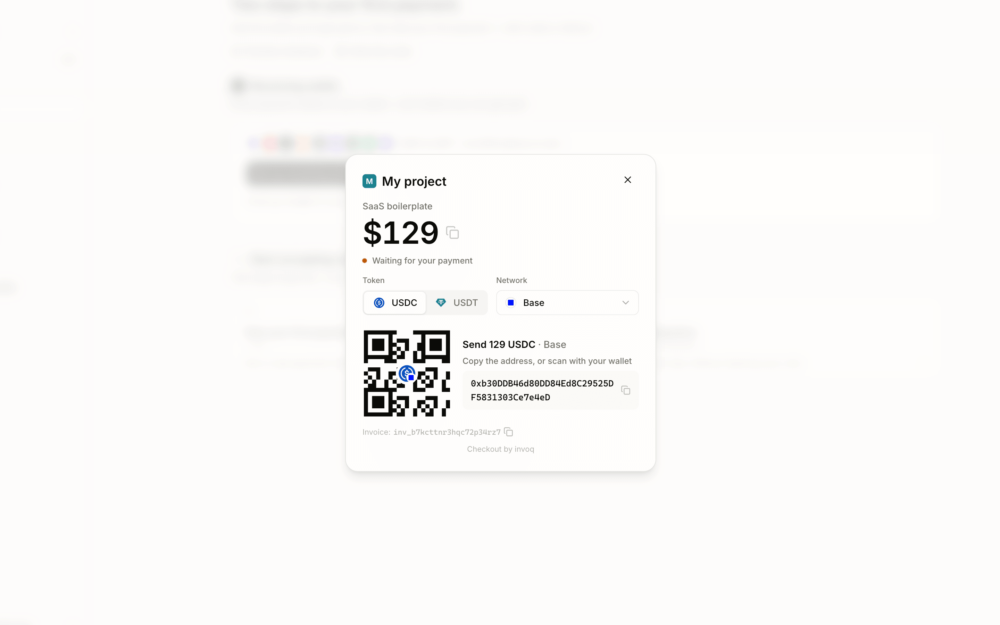

# SDKs de invoq para JavaScript

[](https://www.npmjs.com/package/@invoq/server)
[](https://www.npmjs.com/package/@invoq/checkout)
[](https://github.com/invoqmoney/sdk-js/actions/workflows/ci.yml)
[](../LICENSE)

[English](../README.md) · [Bahasa Indonesia](./README.id.md) · **Español** · [Français](./README.fr.md) · [Português](./README.pt-BR.md) · [Tiếng Việt](./README.vi.md) · [Türkçe](./README.tr.md) · [ไทย](./README.th.md) · [简体中文](./README.zh-Hans.md) · [繁體中文](./README.zh-Hant.md)

> Este documento es una traducción del README en inglés; si algo difiere, vale la [versión en inglés](../README.md).

Acepta pagos en stablecoins en tu sitio web con una ventana de pago integrada en la página, sin que el comprador tenga que salir de ella. [invoq](https://invoq.money) no custodia fondos: el dinero llega directo a tu propia billetera, invoq nunca lo retiene.

- Crea facturas de pago desde tu servidor.
- Abre una ventana de pago en stablecoins dentro de tu sitio.
- Procesa pedidos de forma segura con webhooks firmados.



¿Quieres verlo primero? La página de inicio de [invoq.money](https://invoq.money) tiene una demo interactiva de este checkout: puedes completar un pago simulado en segundos.

**¿Programas con IA? Pega esto.**

```
Agrega pagos con stablecoins a mi proyecto con invoq. Empieza en modo de prueba. Lee la documentación antes de escribir código: https://invoq.money/llms.txt
```

## Por qué invoq

- **Tu billetera, no la nuestra.** Cada pago aterriza en una billetera que solo tú controlas — invoq no puede cambiar su destino.
- **USDC y USDT en nueve redes.** Base, TRON, Solana, BNB Chain, Arbitrum, Polygon, HyperEVM, Morph, Ethereum.
- **Sin gas para cobrar.** El comprador paga su propia comisión de envío; invoq cubre la liquidación on-chain.
- **Tus compradores no se registran en nada.** Cualquier billetera puede pagar — directo desde un exchange también funciona. El checkout está disponible en diez idiomas.
- **Precios simples.** Regístrate durante la beta y tu cuenta queda gratis para siempre — mira los precios vigentes en [invoq.money](https://invoq.money).

## SDKs de servidor

Crea facturas y verifica webhooks desde tu backend en cualquiera de estos lenguajes — la misma REST API y la misma firma de webhook. Este repositorio es el SDK de JavaScript.

| Lenguaje | Repositorio                                                                  |
| -------- | ---------------------------------------------------------------------------- |
| Node.js  | **este repositorio** — `@invoq/server`                                       |
| Python   | [github.com/invoqmoney/sdk-python](https://github.com/invoqmoney/sdk-python) |
| PHP      | [github.com/invoqmoney/sdk-php](https://github.com/invoqmoney/sdk-php)       |
| Go       | [github.com/invoqmoney/sdk-go](https://github.com/invoqmoney/sdk-go)         |
| Rust     | [github.com/invoqmoney/sdk-rust](https://github.com/invoqmoney/sdk-rust)     |
| Ruby     | [github.com/invoqmoney/sdk-ruby](https://github.com/invoqmoney/sdk-ruby)     |

Elijas el backend que elijas, el lado del navegador es el mismo: **`@invoq/checkout`** (en este repositorio) abre la ventana de pago integrada en la página para cualquier frontend.

## Instalación

Instala el paquete de servidor en tu backend:

```sh
npm install @invoq/server
```

Instala el paquete de checkout en tu frontend:

```sh
npm install @invoq/checkout
```

Ambos paquetes están escritos en TypeScript e incluyen definiciones de tipos. `@invoq/server` requiere Node.js 20 o más nuevo — en producción, usa una línea LTS de Node.js con soporte vigente, como Node.js 22 o 24. `@invoq/checkout` no tiene dependencias en tiempo de ejecución y funciona con cualquier framework, o directo desde un `<script>` de CDN.

## Consigue tus claves

1. Inicia sesión en el [panel de invoq](https://app.invoq.money) y crea un proyecto.
2. En la página **API keys**, crea una clave secreta. Las claves de prueba empiezan con `sk_test_`, las claves de producción con `sk_live_`. El modo de la clave determina si las facturas son de prueba o de producción.
3. En la configuración de **webhooks** de tu proyecto, guarda tu URL de webhook. El secreto del webhook (`whsec_...`) de ese modo se muestra una sola vez, cuando activas el webhook por primera vez — guárdalo de inmediato. La URL del webhook debe ser HTTPS y pública.
4. Configura tu **Receiving wallet** antes de pasar a producción. Las facturas de prueba no la necesitan; una factura real sin destino de liquidación falla con `409 no_payment_options_available`.

Agrega ambos al entorno de tu servidor:

```sh
INVOQ_SECRET_KEY=sk_test_...
INVOQ_WEBHOOK_SECRET=whsec_...
```

Empieza con las claves de prueba. Cambia a la clave de producción y al secreto de webhook de producción cuando pases a producción.

## Inicio rápido

Vas a agregar:

- Una ruta de servidor para crear la factura.
- Una ruta de servidor para recibir webhooks.
- Un botón en el frontend para abrir el checkout.

Crea una factura en tu servidor con tu clave secreta:

```ts
import { Invoq } from '@invoq/server'

const invoq = new Invoq(process.env.INVOQ_SECRET_KEY!)

export async function POST() {
  const invoice = await invoq.invoices.create({
    amount: '129',
    description: 'SaaS boilerplate',
    reference_id: 'order_1234',
  })

  return Response.json({ invoiceId: invoice.id })
}
```

Notas:

- Los ejemplos de servidor usan manejadores de rutas basados en la Web Fetch API (Next.js App Router, Hono y similares). En Express, envía la respuesta con `res.json({ invoiceId: invoice.id })`.
- Define el monto en el servidor. No confíes en montos que manda el cliente.
- `amount` es una cadena decimal en USD de `'0.01'` a `'1000000.00'` con hasta 2 decimales, como `'129'` o `'129.99'`. La moneda siempre es USD, y el modo de prueba o real viene de la clave — ninguno de los dos es un campo de la solicitud.
- Usa `reference_id` para vincular los webhooks `invoice.paid` con tu pedido. También hace que puedas reintentar la creación sin riesgo: si creas otra factura con el mismo `reference_id` y los mismos términos, recibes la factura existente en lugar de un duplicado; si los términos son distintos, falla con un error de API `409 reference_id_conflict`.

En tu frontend, llama primero a tu ruta de servidor y pasa el `invoiceId` devuelto al checkout:

```tsx
'use client'

import { openCheckout } from '@invoq/checkout'

export function PayButton() {
  async function handlePay() {
    const response = await fetch('/api/invoq/invoices', {
      method: 'POST',
    })
    const { invoiceId } = await response.json()
    const result = await openCheckout(invoiceId).result

    if (result.status === 'paid' || result.status === 'overpaid') {
      // Muestra un estado de éxito en tu UI.
    } else if (result.status === 'review_required') {
      // Muestra un estado pendiente de revisión. No proceses el pedido desde el resultado del navegador.
    } else if (result.status === 'failed') {
      // El checkout no cargó. Muestra un error y ofrece reintentar.
    }
  }

  return <button onClick={handlePay}>Pagar con stablecoin</button>
}
```

`@invoq/checkout` no depende de ningún framework. React, Vue, Svelte, JavaScript puro y cualquier otro frontend usan la misma llamada `openCheckout(invoiceId)`.

Recibe los webhooks en tu servidor:

```ts
import { isInvoicePaid, verifyWebhook } from '@invoq/server'

export async function POST(request: Request) {
  const event = verifyWebhook(
    await request.text(),
    request.headers,
    process.env.INVOQ_WEBHOOK_SECRET!,
  )

  if (isInvoicePaid(event)) {
    // Procesa el pedido de esta factura.
    // event.data.invoice.reference_id es tu reference_id.
  }

  return Response.json({ received: true })
}
```

Usa los webhooks `invoice.paid` para procesar los pedidos en tu servidor. Cuando `isInvoicePaid(event)` es true, la factura está lista para procesarse automáticamente; usa su `reference_id` para encontrar tu pedido. Una factura `review_required` no emite ningún `invoice.paid` hasta que se apruebe la revisión.

invoq también envía `invoice.payment_reversed` cuando una factura ya pagada vuelve a quedar por debajo de su monto — por ejemplo, si una reorganización de la cadena descarta una transferencia confirmada. Detéctalo con `isInvoicePaymentReversed(event)` y retén o revierte el procesamiento según tu propia política.

Los resultados `paid`, `overpaid` y `review_required` del navegador son solo señales para la interfaz. No proceses pedidos a partir de resultados del navegador. En producción, agrega tu propio estado de carga y manejo de errores alrededor de este flujo.

## Página de pago alojada

Cada factura también tiene una página de pago alojada en `https://pay.invoq.money/<id de factura>` — comparte el enlace o redirige ahí cuando la ventana integrada no encaje. También puedes crear facturas y copiar sus enlaces de pago en el [panel](https://app.invoq.money), sin escribir código.

## Pruébalo de punta a punta

Las facturas de prueba no pueden recibir fondos reales. Simula el pago desde tu servidor:

```ts
const paid = await invoq.invoices.createTestPayment(invoice.id, {
  amount: invoice.amount,
})

console.log(paid.status) // 'paid'
```

`createTestPayment` solo funciona con facturas creadas con una clave `sk_test_`. Cuando los pagos alcanzan el monto de la factura, la factura pasa a `paid` e invoq envía un webhook `invoice.paid` firmado de verdad a tu URL de webhook de prueba, así que pruebas todo tu flujo de procesamiento de pedidos. Se permiten montos parciales, que producen `partially_paid`.

Para recibir webhooks en tu máquina, expón tu servidor local con un túnel HTTPS como ngrok o cloudflared y guarda la URL del túnel como tu URL de webhook de prueba en el panel.

## Webhooks en producción

**Verifica el cuerpo sin procesar de la solicitud.** Las firmas se calculan sobre los bytes exactos que envía invoq. Si tu framework procesa el JSON antes de que puedas leer el texto sin procesar, la verificación falla. Por ejemplo, en Express:

```ts
import express from 'express'
import { isInvoicePaid, verifyWebhook } from '@invoq/server'

app.post(
  '/invoq/webhook',
  express.raw({ type: 'application/json' }),
  (req, res) => {
    let event
    try {
      event = verifyWebhook(
        req.body,
        req.headers,
        process.env.INVOQ_WEBHOOK_SECRET!,
      )
    } catch {
      res.status(400).json({ error: 'invalid signature' })
      return
    }

    if (isInvoicePaid(event)) {
      // Procesa el pedido.
    }

    res.json({ received: true })
  },
)
```

**Procesa de forma idempotente.** Las entregas fallidas se reintentan (hasta 5 intentos, con esperas de 1 minuto, 5 minutos, 30 minutos y luego 2 horas), así que tu ruta puede recibir el mismo evento más de una vez. Registra los pedidos ya procesados por `reference_id` o por `id` de factura y trata las entregas repetidas como operaciones sin efecto. Además pueden llegar desordenadas: quédate con la instantánea que tenga el `payment_revision` más alto.

**Responde con un 2xx rápido.** Cualquier otro estado cuenta como entrega fallida y se reintenta, incluidos los redireccionamientos y los `4xx`, así que una ventana de despliegue o una ruta mal dirigida por un rato se reintenta en lugar de descartarse.

`verifyWebhook` lanza `InvoqSignatureVerificationError` cuando la firma falta, es inválida o el timestamp está corrido más de 5 minutos — responde con un 400. El encabezado de firma es `invoq-signature: t=<segundos unix>,v1=<HMAC-SHA256 en hex de "<t>.<cuerpo sin procesar>">`, así que puedes verificarlo en cualquier lenguaje.

## Referencia de la API

### `@invoq/server`

```ts
const invoq = new Invoq(apiKey, {
  apiOrigin: 'https://api.invoq.money', // opcional, sobrescribe el valor predeterminado
  timeoutMs: 10_000, // opcional, tiempo de espera de la solicitud, predeterminado 10 s
})
```

- `invoq.invoices.create(input)` — crea una factura. `input`: `amount` (requerido), `description`, `reference_id`, `return_url`.
- `invoq.invoices.get(invoiceId)` — trae una factura pública.
- `invoq.invoices.createTestPayment(invoiceId, { amount, reference_id? })` — simula un pago en una factura de prueba.

`invoices.get()` devuelve la forma de factura pública usada por la página de checkout hospedada: la forma de la respuesta de creación más `amount_paid`, `project` y `transfers`, y sin `reference_id`. Usa la respuesta de creación o el webhook `invoice.paid` cuando necesites tu `reference_id` de comercio.

Dos campos de estado. `status` es el contable — `unpaid`, `partially_paid`, `paid`, `settling`, `settled`, `review_required` — y los tres valores equivalentes a pagada solo se diferencian en qué tan lejos llegaron los fondos hacia tu billetera. `checkout_status` es el que ve quien paga — `open`, `confirming`, `expired`, `paid`, `unavailable` — y nunca autoriza procesar el pedido. `payment_revision` sube cada vez que cambia el conjunto de pagos confirmados, así descartas una instantánea más vieja que la que ya tienes.

Los montos en las respuestas se normalizan a 4 decimales: crea con `'129'` y la factura devuelve `amount: '129.0000'`. Compara montos numéricamente, no como cadenas. `amount_due` se deriva como `max(amount - amount_paid, 0)` y usa la misma escala de 18 decimales que `amount_paid`; `amount_overpaid` es su reflejo, `max(amount_paid - amount, 0)`, así que nunca restas dinero por tu cuenta.

`payment_options` contiene las instrucciones de pago, fijadas al crear la factura y `[]` en modo de prueba. Las entradas se discriminan por `status` y luego por `collection_method`: solo `'ready'` es pagable, `'evm_deposit'` trae `deposit_address` y `suggested_amount`, `'direct_exact'` trae `recipient_address` y un `exact_amount` que el comprador debe enviar hasta el último dígito. `transfers` es el registro confirmado de recepciones — `transaction_id`, `event_index`, `amount`, `explorer_transaction_url` — y queda en `[]` hasta que se confirme un pago. Referencia completa: [documentación de la API REST](https://github.com/invoqmoney/api).

Cuando fallan, los métodos devuelven una promesa rechazada con:

- `InvoqApiError` para respuestas de API no 2xx — tiene `status`, `code`, `fields`, `meta` y el `payload` crudo.
- `InvoqError` para fallas de conexión, tiempos de espera agotados y entradas inválidas.

Las solicitudes expiran a los 10 segundos por defecto (`timeoutMs`). Un `create` que expiró es seguro de reintentar con el mismo `reference_id` — recuperas la factura existente, nunca un duplicado.

`verifyWebhook(rawBody, headers, secret)` acepta el cuerpo sin procesar como cadena, `Uint8Array` o `Buffer` de Node, y los encabezados como un objeto `Headers` de Fetch o un objeto plano de encabezados de Node. Devuelve el evento procesado o lanza `InvoqSignatureVerificationError`. Usa `isInvoicePaid(event)` para eventos `invoice.paid` que permiten procesar pedidos; acepta estados de factura equivalentes a pagada (`paid`, `settling` o `settled`) y rechaza `review_required`. Usa `isInvoicePaymentReversed(event)` para `invoice.payment_reversed`. Ambos acotan el tipo del evento; un tipo de evento que esta versión del SDK todavía no modela igual se verifica y se devuelve tal cual.

### `@invoq/checkout`

```ts
const checkout = openCheckout(invoiceId, {
  checkoutOrigin: 'https://embed.invoq.money', // opcional, sobrescribe el valor predeterminado
  locale: undefined, // opcional, idioma de la interfaz; por defecto el del navegador
  styleNonce: undefined, // opcional, nonce CSP para el <style> inyectado
  signal: undefined, // opcional, AbortSignal que cierra la ventana
})

checkout.invoiceId // el id de la factura
checkout.close() // cerrar desde código
const result = await checkout.result
```

La promesa de `result` siempre se resuelve y nunca se rechaza, con uno de estos valores:

- `{ status: 'paid' | 'overpaid', invoiceId, mode }` — pago confirmado. La ventana queda abierta mostrando la pantalla de éxito del embed hasta que el comprador la cierre; llama primero a `checkout.close()` si vas a navegar de inmediato.
- `{ status: 'review_required', invoiceId, mode }` — pago recibido, pero retenido para revisión manual. Muestra un estado pendiente.
- `{ status: 'closed', invoiceId, reason }` — se cerró sin pago. `reason` es `'user'` (botón de cerrar o Escape), `'programmatic'` (`checkout.close()`), `'replaced'` (otra llamada a `openCheckout`) o `'aborted'` (se disparó el `signal`).
- `{ status: 'failed', invoiceId }` — el checkout no cargó en 15 segundos.

En los resultados de pago, `mode` es `'test'` o `'live'`, así distingues en el navegador un pago simulado de dinero real — solo orientativo, procesa el pedido con el webhook.

`locale` acepta una etiqueta BCP 47 (`'fr'`, `'pt-BR'`, `'zh-Hant'`, …). El checkout habla diez idiomas y asigna la etiqueta al más cercano, así que una región que no tenga nunca es un error.

`openCheckout` en sí lanza error con entradas inválidas (`invoiceId` debe empezar con `inv_`) y en navegadores sin soporte de Shadow DOM. Solo hay un checkout abierto a la vez; abrir otro cierra el anterior con `reason: 'replaced'`.

Sin bundler, carga el build de navegador desde un CDN. Expone una variable global `Invoq`:

```html
<script src="https://unpkg.com/@invoq/checkout"></script>
<script>
  Invoq.openCheckout(invoiceId)
</script>
```

## Sobrescribir el entorno

Valores predeterminados de producción:

- Origin de la API: `https://api.invoq.money`
- Origin del checkout: `https://embed.invoq.money`

Sobrescríbelos durante el desarrollo local o las pruebas de previsualización:

```ts
const invoq = new Invoq(process.env.INVOQ_SECRET_KEY!, {
  apiOrigin: 'http://localhost:8787',
})
```

```ts
openCheckout(invoiceId, {
  checkoutOrigin: 'http://localhost:3000',
})
```

`apiOrigin` y `checkoutOrigin` deben ser orígenes `http` o `https` absolutos. El SDK de servidor les agrega las rutas de API `/v1/...`. El SDK de checkout les agrega `/:invoiceId` y los parámetros de consulta del checkout.

## Comunidad y soporte

- X: [@invoqmoney](https://x.com/invoqmoney) · 中文: [@invoqcn](https://x.com/invoqcn)
- Chat: [Discord](https://discord.gg/V8cVrg4dET)
- Novedades: [Canal de Telegram](https://telegram.me/invoqmoney)
- Correo: help@invoq.money

Si invoq te resulta útil, una estrella en este repositorio ayuda a que otros lo encuentren.

## Licencia

[MIT](../LICENSE)
