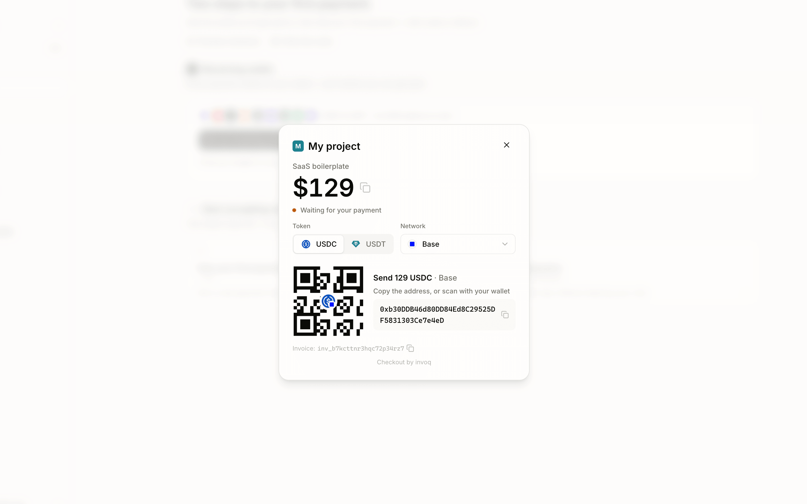

# invoq JavaScript SDK

[](https://www.npmjs.com/package/@invoq/server)
[](https://www.npmjs.com/package/@invoq/checkout)
[](https://github.com/invoqmoney/sdk-js/actions/workflows/ci.yml)
[](../LICENSE)

[English](../README.md) · [Bahasa Indonesia](./README.id.md) · [Español](./README.es-419.md) · [Français](./README.fr.md) · [Português](./README.pt-BR.md) · **Tiếng Việt** · [Türkçe](./README.tr.md) · [ไทย](./README.th.md) · [简体中文](./README.zh-Hans.md) · [繁體中文](./README.zh-Hant.md)

> Tài liệu này được dịch từ README tiếng Anh; nếu có chỗ khác nhau, [bản tiếng Anh](../README.md) là bản chuẩn.

Nhận thanh toán stablecoin ngay trên website của bạn bằng cửa sổ thanh toán nhúng trong trang — người mua không cần rời khỏi website. [invoq](https://invoq.money) không lưu ký: tiền về thẳng ví của chính bạn, invoq không bao giờ giữ tiền.

- Tạo hóa đơn thanh toán từ máy chủ của bạn.
- Mở cửa sổ thanh toán stablecoin ngay trong trang web.
- Xử lý đơn hàng an toàn bằng webhook có chữ ký.



Muốn xem trước? Trang chủ [invoq.money](https://invoq.money) chạy sẵn một bản demo tương tác của trang thanh toán này — bạn có thể hoàn tất một khoản thanh toán mô phỏng trong vài giây.

## Vì sao chọn invoq

- **Ví của bạn, không phải của chúng tôi.** Mỗi khoản thanh toán đều về ví do bạn kiểm soát — invoq không thể đổi hướng nó.
- **USDC & USDT trên chín mạng.** Base, TRON, Solana, BNB Chain, Arbitrum, Polygon, HyperEVM, Morph, Ethereum.
- **Nhận tiền không tốn gas.** Phí chuyển do người mua tự trả; phí trên chuỗi để tiền về ví thì invoq lo.
- **Người mua không phải đăng ký gì.** Ví nào cũng trả được — trả thẳng từ sàn cũng xong. Trang thanh toán hỗ trợ mười ngôn ngữ.
- **Giá đơn giản.** Miễn phí 10 khoản thanh toán đầu tiên, sau đó 0,5%, không còn phí nào khác — xem giá hiện hành tại [invoq.money](https://invoq.money).

## SDK server

Tạo hóa đơn và xác minh webhook từ backend của bạn bằng bất kỳ ngôn ngữ nào dưới đây — cùng REST API, cùng chữ ký webhook. Repo này là SDK JavaScript.

| Ngôn ngữ | Repo |
| --- | --- |
| Node.js | **repo này** — `@invoq/server` |
| Python | [github.com/invoqmoney/sdk-python](https://github.com/invoqmoney/sdk-python) |
| PHP | [github.com/invoqmoney/sdk-php](https://github.com/invoqmoney/sdk-php) |
| Go | [github.com/invoqmoney/sdk-go](https://github.com/invoqmoney/sdk-go) |
| Rust | [github.com/invoqmoney/sdk-rust](https://github.com/invoqmoney/sdk-rust) |
| Ruby | [github.com/invoqmoney/sdk-ruby](https://github.com/invoqmoney/sdk-ruby) |

Dù bạn chọn backend nào, phía trình duyệt vẫn như nhau: **`@invoq/checkout`** (trong repo này) mở cửa sổ thanh toán nhúng trong trang cho mọi frontend.

## Cài đặt

Cài gói server ở backend:

```sh
npm install @invoq/server
```

Cài gói checkout ở frontend:

```sh
npm install @invoq/checkout
```

Cả hai gói đều viết bằng TypeScript và có sẵn định nghĩa kiểu. `@invoq/server` yêu cầu Node.js 20 trở lên — trong môi trường chạy thật, hãy dùng một dòng Node.js LTS còn được hỗ trợ, ví dụ Node.js 22 hoặc 24. `@invoq/checkout` không có phụ thuộc lúc chạy, dùng được với mọi framework, hoặc nạp thẳng qua thẻ `<script>` từ CDN.

## Lấy khóa API

1. Đăng nhập [bảng điều khiển invoq](https://app.invoq.money) và tạo một dự án.
2. Ở trang **API keys**, tạo một khóa bí mật. Khóa thử nghiệm bắt đầu bằng `sk_test_`, khóa thật bằng `sk_live_`. Loại khóa quyết định hóa đơn tạo ra là thử nghiệm hay thật.
3. Trong phần cài đặt **webhooks** của dự án, lưu URL webhook của bạn. Mã bí mật của webhook (`whsec_...`) cho chế độ đó chỉ hiện đúng một lần, lúc bạn bật webhook lần đầu — hãy lưu lại ngay. URL webhook phải là URL HTTPS truy cập công khai được.

Thêm cả hai vào biến môi trường của máy chủ:

```sh
INVOQ_SECRET_KEY=sk_test_...
INVOQ_WEBHOOK_SECRET=whsec_...
```

Bắt đầu bằng khóa thử nghiệm. Khi chạy thật thì đổi sang khóa thật và mã bí mật webhook cho môi trường thật.

## Bắt đầu nhanh

Bạn sẽ thêm:

- Một endpoint máy chủ để tạo hóa đơn.
- Một endpoint máy chủ để nhận webhook.
- Một nút ở frontend để mở trang thanh toán.

Tạo hóa đơn trên máy chủ bằng khóa bí mật:

```ts
import { Invoq } from '@invoq/server'

const invoq = new Invoq(process.env.INVOQ_SECRET_KEY!)

export async function POST() {
  const invoice = await invoq.invoices.create({
    amount: '129',
    currency: 'USD',
    description: 'SaaS boilerplate',
    reference_id: 'order_1234',
  })

  return Response.json({ invoiceId: invoice.id })
}
```

Lưu ý:

- Các ví dụ máy chủ dùng trình xử lý route dựa trên Web Fetch API (Next.js App Router, Hono và tương tự). Với Express, trả về bằng `res.json({ invoiceId: invoice.id })`.
- Số tiền phải do máy chủ quyết định. Đừng tin số tiền phía client gửi lên.
- `amount` là chuỗi thập phân USD từ `'0.01'` đến `'999.99'`, tối đa 2 chữ số lẻ, ví dụ `'129'` hoặc `'129.99'`.
- Dùng `reference_id` để nối webhook `invoice.paid` về đúng đơn hàng của bạn. Nó cũng giúp thao tác tạo an toàn khi thử lại: tạo lại với cùng `reference_id` và cùng nội dung hóa đơn sẽ trả về hóa đơn đã có thay vì tạo trùng; nếu nội dung khác nhau, API sẽ báo lỗi `409 reference_id_conflict`.

Ở frontend, gọi endpoint máy chủ của bạn trước, rồi đưa `invoiceId` nhận được cho trang thanh toán:

```tsx
'use client'

import { openCheckout } from '@invoq/checkout'

export function PayButton() {
  async function handlePay() {
    const response = await fetch('/api/invoq/invoices', {
      method: 'POST',
    })
    const { invoiceId } = await response.json()
    const result = await openCheckout(invoiceId).result

    if (result.status === 'paid' || result.status === 'overpaid') {
      // Hiện trạng thái thanh toán thành công trong UI của bạn.
    } else if (result.status === 'review_required') {
      // Hiển thị trạng thái chờ duyệt. Đừng xử lý đơn từ kết quả trình duyệt.
    } else if (result.status === 'failed') {
      // Trang thanh toán không tải được. Báo lỗi và cho người dùng thử lại.
    }
  }

  return <button onClick={handlePay}>Thanh toán bằng stablecoin</button>
}
```

`@invoq/checkout` không kén framework. React, Vue, Svelte, JavaScript thuần hay bất kỳ frontend nào khác đều dùng chung một lệnh gọi `openCheckout(invoiceId)`.

Nhận webhook trên máy chủ:

```ts
import { isInvoicePaid, verifyWebhook } from '@invoq/server'

export async function POST(request: Request) {
  const event = verifyWebhook(
    await request.text(),
    request.headers,
    process.env.INVOQ_WEBHOOK_SECRET!,
  )

  if (isInvoicePaid(event)) {
    // Xử lý đơn hàng của hóa đơn này.
    // event.data.invoice.reference_id chính là reference_id bạn đã truyền.
  }

  return Response.json({ received: true })
}
```

Hãy dựa vào webhook `invoice.paid` để xử lý đơn hàng trên máy chủ. Khi `isInvoicePaid(event)` là true, hóa đơn đã sẵn sàng để xử lý tự động; dùng `reference_id` trong hóa đơn để tìm và xử lý đúng đơn. Hóa đơn ở trạng thái `review_required` hiện chưa gửi webhook `invoice.paid`; nếu checkout trả về `review_required`, hãy hiển thị trạng thái chờ duyệt và đợi webhook `invoice.paid` sau khi duyệt xong.

Kết quả `paid` / `overpaid` / `review_required` trên trình duyệt chỉ là tín hiệu cho giao diện. Đừng xử lý đơn hàng dựa trên kết quả từ trình duyệt. Khi chạy thật, hãy tự thêm trạng thái đang tải và xử lý lỗi quanh luồng này.

## Trang thanh toán được lưu trữ sẵn

Mỗi hóa đơn còn có một trang thanh toán được lưu trữ sẵn tại `https://pay.invoq.money/<id hóa đơn>` — cứ gửi link hoặc chuyển hướng sang đó khi cửa sổ trong trang không phù hợp. Bạn cũng có thể tạo hóa đơn và sao chép link thanh toán ngay trong [bảng điều khiển](https://app.invoq.money), không cần dòng code nào.

## Kiểm thử từ đầu đến cuối

Hóa đơn thử nghiệm không nhận được tiền thật. Hãy mô phỏng thanh toán từ máy chủ:

```ts
const paid = await invoq.invoices.createTestPayment(invoice.id, {
  amount: invoice.amount,
})

console.log(paid.status) // 'paid'
```

`createTestPayment` chỉ dùng được với hóa đơn tạo bằng khóa `sk_test_`. Khi số tiền thanh toán đạt đủ giá trị hóa đơn, hóa đơn chuyển sang `paid` và invoq gửi một webhook `invoice.paid` có chữ ký thật đến URL webhook thử nghiệm của bạn — nghĩa là cả đường xử lý đơn hàng của bạn đều được chạy thử. Có thể trả từng phần, hóa đơn sẽ thành `partially_paid`.

Để nhận webhook trên máy của mình, hãy mở máy chủ local ra ngoài bằng một tunnel HTTPS như ngrok hay cloudflared, rồi lưu URL tunnel làm URL webhook thử nghiệm trong bảng điều khiển. Bảng điều khiển cũng gửi được một `webhook.ping` có chữ ký để kiểm tra kết nối.

## Webhook khi chạy thật

**Xác minh trên nội dung request gốc.** Chữ ký được tính trên đúng từng byte mà invoq gửi đi. Nếu framework của bạn phân tích JSON trước khi bạn kịp đọc nội dung gốc, việc xác minh sẽ thất bại. Ví dụ với Express:

```ts
import express from 'express'
import { isInvoicePaid, verifyWebhook } from '@invoq/server'

app.post(
  '/invoq/webhook',
  express.raw({ type: 'application/json' }),
  (req, res) => {
    let event
    try {
      event = verifyWebhook(
        req.body,
        req.headers,
        process.env.INVOQ_WEBHOOK_SECRET!,
      )
    } catch {
      res.status(400).json({ error: 'invalid signature' })
      return
    }

    if (isInvoicePaid(event)) {
      // Xử lý đơn hàng.
    }

    res.json({ received: true })
  },
)
```

**Xử lý lặp lại phải an toàn.** Lần gửi thất bại sẽ được gửi lại (tối đa 5 lần trong vài giờ, khoảng cách giữa các lần tăng dần), nên endpoint của bạn có thể nhận cùng một sự kiện nhiều lần. Ghi lại các đơn đã xử lý theo `reference_id` hoặc `id` hóa đơn, rồi bỏ qua những lần gửi lặp lại.

**Trả về 2xx thật nhanh.** Mọi mã trạng thái khác đều bị tính là giao thất bại: timeout, `429` và `5xx` sẽ được gửi lại, còn `4xx` khác thì không.

`verifyWebhook` ném `InvoqSignatureVerificationError` khi chữ ký thiếu, sai, hoặc timestamp lệch quá 5 phút — lúc đó trả về 400. Header chữ ký có dạng `invoq-signature: t=<giây unix>,v1=<HMAC-SHA256 dạng hex của "<t>.<nội dung request gốc>">`, nên bạn có thể tự xác minh bằng bất kỳ ngôn ngữ nào.

## Tham chiếu API

### `@invoq/server`

```ts
const invoq = new Invoq(apiKey, {
  apiOrigin: 'https://api.invoq.money', // tùy chọn, ghi đè mặc định
  timeoutMs: 10_000, // tùy chọn, thời gian chờ request, mặc định 10 giây
})
```

- `invoq.invoices.create(input)` — tạo hóa đơn. `input`: `amount` (bắt buộc), `currency` (`'USD'`, mặc định), `description`, `reference_id`, `return_url`.
- `invoq.invoices.get(invoiceId)` — lấy thông tin hóa đơn công khai.
- `invoq.invoices.createTestPayment(invoiceId, { amount, reference_id? })` — mô phỏng thanh toán trên hóa đơn thử nghiệm.

`invoices.get()` trả về dạng hóa đơn công khai mà trang checkout được host sử dụng. Nó bao gồm các trường dành cho checkout như `amount_paid`, `amount_due`, `payment_status`, `project`, `deposit_address`, `monitoring_ends_at` và `direct_onchain_rails`, nhưng không bao gồm `reference_id`. Hãy dùng phản hồi tạo hóa đơn hoặc webhook `invoice.paid` khi bạn cần `reference_id` phía merchant.

Số tiền trong phản hồi được chuẩn hóa về 4 chữ số lẻ: tạo với `'129'` thì hóa đơn trả về `amount: '129.0000'`. So sánh số tiền theo giá trị số, đừng so sánh chuỗi.
`amount_due` được tính là `max(amount - amount_paid, 0)` và dùng cùng thang 18 chữ số thập phân như `amount_paid`.

Khi thất bại, mọi phương thức trả về `Promise` bị reject với một trong các lỗi sau:

- `InvoqApiError` cho phản hồi API không phải 2xx — có `status`, `code`, `fields`, `meta` và `payload` gốc.
- `InvoqError` cho lỗi kết nối, hết thời gian chờ và tham số không hợp lệ.

Request mặc định hết hạn sau 10 giây (`timeoutMs`). `create` bị hết hạn có thể thử lại an toàn với cùng `reference_id` — bạn nhận lại đúng hóa đơn cũ, không bao giờ bị trùng.

`verifyWebhook(rawBody, headers, secret)` nhận nội dung request gốc dạng chuỗi, `Uint8Array` hoặc `Buffer` của Node; headers nhận đối tượng `Headers` của Fetch hoặc đối tượng header thường của Node. Nó trả về sự kiện đã phân tích, hoặc ném `InvoqSignatureVerificationError`. Dùng `isInvoicePaid(event)` cho sự kiện `invoice.paid` có thể xử lý; hàm này chấp nhận các trạng thái hóa đơn tương đương đã thanh toán (`paid`, `settling` hoặc `settled`) và từ chối `review_required`.

### `@invoq/checkout`

```ts
const checkout = openCheckout(invoiceId, {
  checkoutOrigin: 'https://embed.invoq.money', // tùy chọn, ghi đè mặc định
  styleNonce: undefined, // tùy chọn, CSP nonce cho thẻ <style> được chèn
  signal: undefined, // tùy chọn, AbortSignal để đóng cửa sổ
})

checkout.invoiceId // id hóa đơn
checkout.close() // đóng bằng code
const result = await checkout.result
```

`Promise` của `result` luôn resolve và không bao giờ reject, với một trong các giá trị:

- `{ status: 'paid' | 'overpaid', invoiceId }` — thanh toán đã xác nhận. Cửa sổ vẫn mở ở màn hình thành công cho đến khi người mua tự đóng; nếu bạn muốn chuyển trang ngay, hãy gọi `checkout.close()` trước.
- `{ status: 'review_required', invoiceId }` — đã nhận thanh toán nhưng cần duyệt thủ công. Hiển thị trạng thái chờ duyệt; đừng xử lý đơn từ kết quả trình duyệt.
- `{ status: 'closed', invoiceId, reason }` — đóng mà chưa thanh toán. `reason` là `'user'` (nút đóng hoặc phím Escape), `'programmatic'` (`checkout.close()`), `'replaced'` (một lệnh `openCheckout` khác), hoặc `'aborted'` (`signal` được kích hoạt).
- `{ status: 'failed', invoiceId }` — trang thanh toán không tải xong trong 15 giây.

Bản thân `openCheckout` sẽ ném lỗi khi tham số không hợp lệ (`invoiceId` phải bắt đầu bằng `inv_`) và trên trình duyệt không hỗ trợ Shadow DOM. Mỗi lúc chỉ có một trang thanh toán mở; mở cái mới sẽ đóng cái cũ với `reason: 'replaced'`.

Không dùng bundler thì nạp bản build cho trình duyệt từ CDN. Nó cung cấp biến toàn cục `Invoq`:

```html
<script src="https://unpkg.com/@invoq/checkout"></script>
<script>
  Invoq.openCheckout(invoiceId)
</script>
```

## Ghi đè môi trường

Mặc định khi chạy thật:

- Origin API: `https://api.invoq.money`
- Origin trang thanh toán: `https://embed.invoq.money`

Ghi đè chúng khi phát triển local hoặc chạy thử bản xem trước:

```ts
const invoq = new Invoq(process.env.INVOQ_SECRET_KEY!, {
  apiOrigin: 'http://localhost:8787',
})
```

```ts
openCheckout(invoiceId, {
  checkoutOrigin: 'http://localhost:3000',
})
```

`apiOrigin` và `checkoutOrigin` phải là origin `http` hoặc `https` tuyệt đối. SDK server sẽ nối thêm đường dẫn API `/v1/...`. SDK checkout sẽ nối thêm `/:invoiceId` và các tham số query của trang thanh toán.

## Cộng đồng & hỗ trợ

- X: [@invoqmoney](https://x.com/invoqmoney) · 中文: [@invoqcn](https://x.com/invoqcn)
- Trò chuyện: [Discord](https://discord.gg/V8cVrg4dET)
- Cập nhật: [Kênh Telegram](https://telegram.me/invoqmoney)
- Email: help@invoq.money

Nếu invoq hữu ích với bạn, một ngôi sao cho repo này sẽ giúp nhiều người tìm thấy nó hơn.

## Giấy phép

[MIT](../LICENSE)
